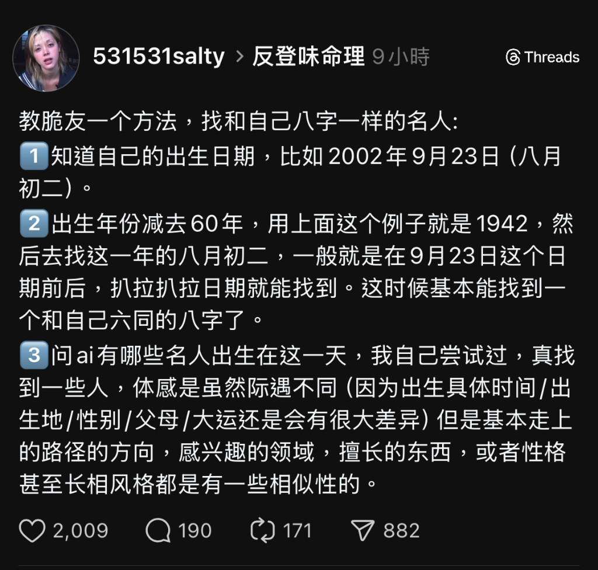

# 彼日 · Nascence

**[English](README.md)**

> 输入你的生日，找到60年前与你同天降生的人，读一封跨越时光寄来的信。

**[nascence.pages.dev](https://nascence.pages.dev)** · 上线至今 6,000+ 独立访问 · 覆盖大陆、台湾、香港、美国、日本

---

## 它是什么

彼日做一件小事：把你的生日往前推六十年，找到那天出生的名人，然后用 AI 以他/她的口吻，写一封给你的信。

不是励志，不是鸡汤。是注视，是辨认——*你们恰好在同一天来到这个世界*。

---

## 在线体验

🌐 **[nascence.pages.dev](https://nascence.pages.dev)**

无需注册，输入生日即用。每个 IP 每日限查 5 次。

---

## 技术架构

```
浏览器 (HTML + JS)
    │  SSE streaming
    ▼
Cloudflare Pages Functions   ← API 代理层
    │  HTTPS
    ▼
SiliconFlow API → DeepSeek V3   ← 内容生成

Cloudflare KV (×2)
  ├── RATE_LIMIT_KV   IP 限流（每日 5 次）
  └── CACHE_KV        名人数据缓存（24h TTL）
```

| 层级 | 技术 | 用途 |
|------|------|------|
| 前端 | 原生 HTML + JavaScript | 无框架，轻量直接 |
| 托管 | Cloudflare Pages | 静态资源 CDN 分发 |
| API 代理 | Cloudflare Pages Functions | 转发请求，保护密钥 |
| AI | SiliconFlow API · DeepSeek V3 | 信件 + 生平内容生成 |
| 限流 | Cloudflare KV (RATE_LIMIT_KV) | 按 IP 每日计数 |
| 缓存 | Cloudflare KV (CACHE_KV) | 名人数据 24h 缓存 |

每次请求经由 **SSE（Server-Sent Events）** 流式传输，信件逐字浮现，而非等待完整响应。

---

## 本地运行

**依赖**：Node.js 18+、[Wrangler CLI](https://developers.cloudflare.com/workers/wrangler/)

```bash
git clone https://github.com/warrior1803-wang/nascence.git
cd nascence

npm install -g wrangler

# KV 在本地模拟运行，无需真实 ID
wrangler dev
```

在 `wrangler.toml` 中填入你的 KV namespace ID（在 Cloudflare Dashboard → Workers & Pages → KV 中创建）：

```toml
[[kv_namespaces]]
binding = "RATE_LIMIT_KV"
id = "<your-kv-id>"

[[kv_namespaces]]
binding = "CACHE_KV"
id = "<your-kv-id>"
```

设置 API 密钥（不要写入代码）：

```bash
wrangler secret put SILICONFLOW_API_KEY
```

---

## 设计思路

### 用 Pages Functions 解决 GFW 问题

SiliconFlow 的 API 域名在中国大陆被 GFW 拦截，前端直接调用对大陆用户完全不可用。

Cloudflare 的边缘节点遍布全球，香港、台湾节点在大陆有良好的可访问性。Pages Functions 部署在这层边缘网络上，相当于在「墙外」架了一个转发通道——前端请求打到 `pages.dev`，再由 Functions 代为访问 SiliconFlow。一次静默的中转，内嵌在基础设施里。

API 密钥始终留在服务端，不出现在前端代码中。

### 用 KV 缓存控制成本

AI 调用不便宜。同一天生日的用户可能有很多，但"某月某日有哪些名人"这个答案是固定的——没必要每次都重新问模型。

于是做了一个分层策略：**名人数据缓存 24 小时，但信件每次新鲜生成。**

这样既控制了成本，又保留了每封信的独特性——你读到的那封信，是专门为这一刻写的。KV 同时承担限流职责，按 IP + 日期做 key，每日最多查询 5 次。

### 语气的克制

系统提示里写了一行：*不是倾诉，是注视；不是安慰，是辨认。* 这是整个项目想要的语气——克制，有一点距离感，但温柔。不用感叹号，不给建议。

信件之外，每位名人还有四个结构化维度：一句话定义、生平时间轴、他们留下了什么、以及三段「印记」（用他们的故事映射你）。结构化内容走缓存；信件，永远现写。

---

## 灵感来源



---

## License

MIT
